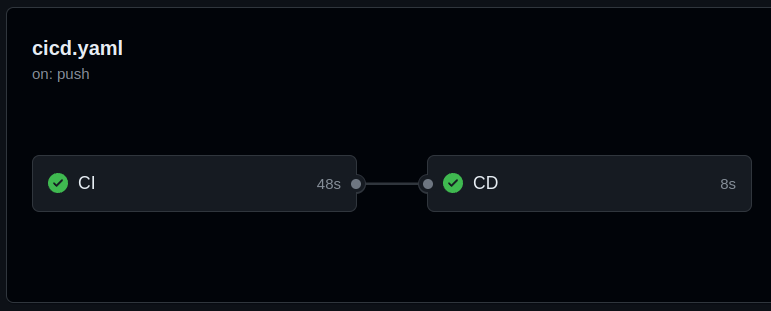
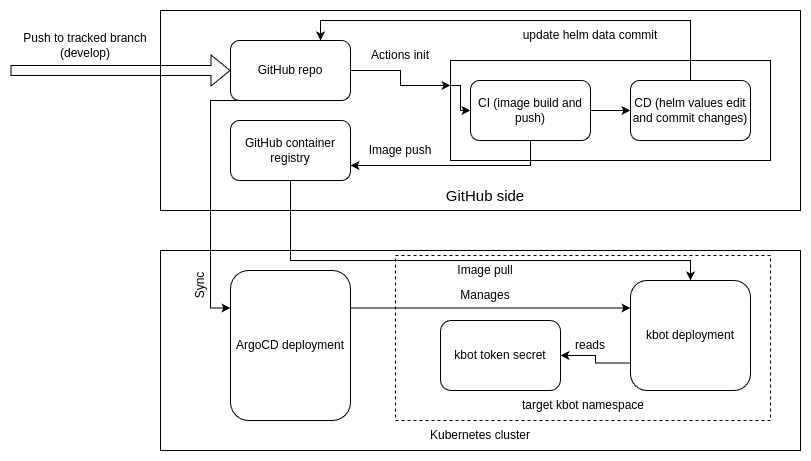

# kbot

## build

```bash
go get
go build -ldflags "-X="github.com/damevanderjahr/kbot/cmd.appVersion=v1.0.2
```

## run

```bash
read -s TELE_TOKEN
# paste token, press enter
export TELE_TOKEN
./kbot start
```

## example

[https://t.me/dmzh_kbot](https://t.me/dmzh_kbot)

## GitHub actions

Now project supports [GitHub actions CICD](.github/workflows/cicd.yaml) on push to the develop branch:



As a result, new build image is published in a [GitHub docker repo](https://github.com/users/damevanderjahr/packages/container/package/kbot)

## Deployment

The project can be deployed as from the helm chart using the CLI:

```bash
helm package helm
helm install kbot-*.tgz
```

In this case it's assuemed, that image from [values.yaml](helm/values.yaml) already exists.

Or using the GitHub workflow + ArgoCD. In this case image is built and pushed via GitHub actions, then deployment is updated via ArgoCD sync mechanism.



In the both cases adding the token secret in the corresponding namespace is required.

### add secret for k8s helm deployment

```bash
kubectl create secret generic kbot \
    --from-literal=token="$TELE_TOKEN"
```

## Flux CD and infrastructure configuration
[Separate repo](https://github.com/damevanderjahr/tf)
